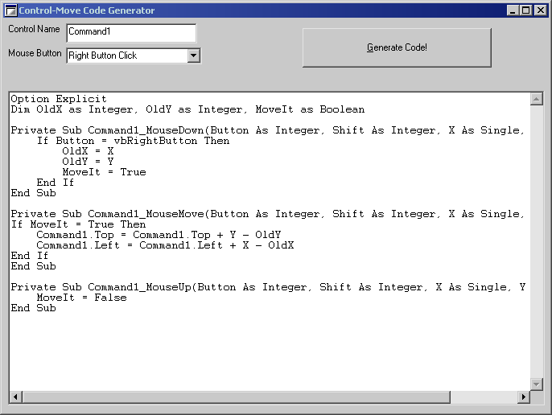



## Control\-Move Code Generator

### Description

Always wanted to allow your controls to be moved at runtime? Don't want to write the code? Easy Solution - Use my control move code generator!
 
### More Info
 

             |
---                |---
**Submitted On**   |2001-06-03 21:19:46
**By**             |[Armen Shimoon](https://github.com/Planet-Source-Code/PSCIndex/blob/master/ByAuthor/armen-shimoon.md)
**Level**          |Beginner
**User Rating**    |4.6 (23 globes from 5 users)
**Compatibility**  |VB 6\.0
**Category**       |[Complete Applications](https://github.com/Planet-Source-Code/PSCIndex/blob/master/ByCategory/complete-applications__1-27.md)
**World**          |[Visual Basic](https://github.com/Planet-Source-Code/PSCIndex/blob/master/ByWorld/visual-basic.md)
**Archive File**   |[Control\-Mo20531632001\.zip](https://github.com/Planet-Source-Code/armen-shimoon-control-move-code-generator__1-23749/archive/master.zip)

